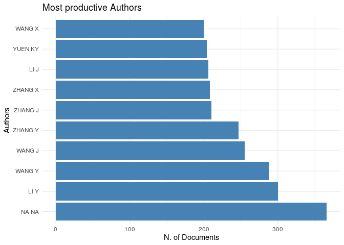
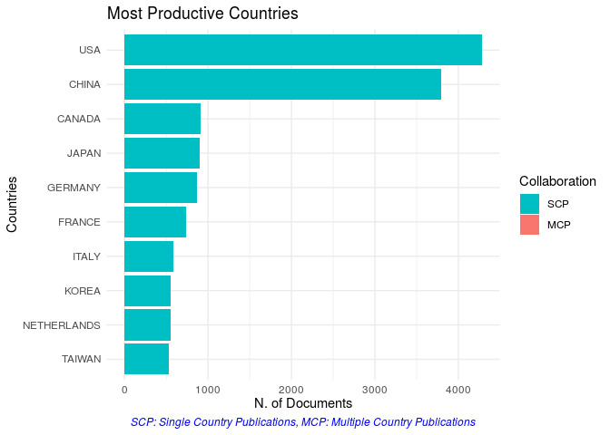
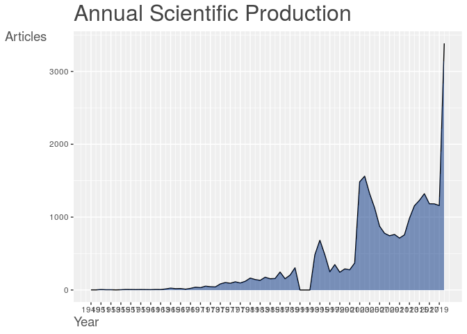
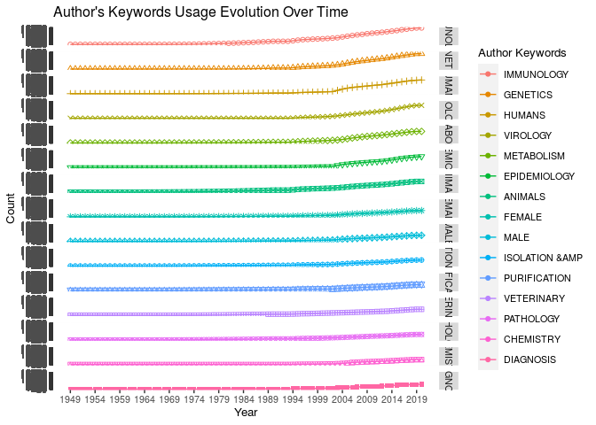

<!-- README.md is generated from README.Rmd. Please edit that file -->

# EpiBibR

<!-- badges: start -->

<!-- badges: end -->

EpiBibR is a R wrapper to easily access bibliographic data on Covid-19
and other medical references. In this global crisis, knowledge and open
data can have an impact. In this regard, our team thought it could be
significant to make available more than 20 000 references (journal
articles,letter,news) through R.

The references were collected via
[PubMed](https://www.ncbi.nlm.nih.gov/pubmed/), a free resource that is
developed and maintained by the National Center for Biotechnology
Information (NCBI), at the U.S. National Library of Medicine (NLM),
located at the National Institutes of Health (NIH). PubMed includes over
30 million citations from biomedical literature.

More specifically, to retrieve our references, we adopted the procedure
used by the Allen Institute for AI for their
[CORD-19](https://pages.semanticscholar.org/coronavirus-research)
project. We apply the same query on PubMed (“COVID-19” OR Coronavirus OR
“Corona virus” OR “2019-nCoV” OR “SARS-CoV” OR “MERS-CoV” OR “Severe
Acute Respiratory Syndrome” OR “Middle East Respiratory Syndrome” ) to
build our own bibliographic data.

To navigate through our bibliographic data, EpiBibR has numerous search
arguments: author, author’s country of origin, keyword in the title,
keyword in the abstract, year and the name of the journal. Each of them
can truly help scientists and R users to filter references and find the
relevant articles.

In an effort to rally our package with the open source community, the
format of our dataframe has been designed to facilitate the use of the R
package [Bibliometrix](https://bibliometrix.org/) on our data.

# Practical usage

## Quick start

First, install corridoR:

``` r
devtools::install_github("warint/EpiBibR")
```

Next, call EpiBibR to make sure everything is installed correctly.

``` r
library(EpiBibR)
```

## Data Summary

| Field Tag | Description                         |
| --------- | ----------------------------------- |
| AU        | Authors                             |
| TI        | Document Title                      |
| AB        | Abstract                            |
| PY        | Year                                |
| DT        | Document Type                       |
| MESH      | Medical Subject Headings Vocabulary |
| TC        | Times Cited                         |
| SO        | Publication Name (or Source)        |
| J9        | Source Abbreviation                 |
| JI        | ISO Source Abbreviation             |
| DI        | Digital Object Identifier (DOI)     |
| ISSN      | Source Code                         |
| VOL       | Volume                              |
| ISSUE     | Issue Number                        |
| LT        | Language                            |
| C1        | Author Address                      |
| RP        | Reprint Address                     |
| ID        | PubMed ID                           |
| DE        | Authors’ Keywords                   |
| UT        | Unique Article Identifier           |
| AU\_CO    | Author’s Country of Origin          |
| DB        | Bibliographic Database              |

## How-To

EpiBibR allows you to search bibligraphic references using several
arguments : Author, author’s country of origin, author + year, keywords
in the title, keywords in the abstract, year and source name.

### Retrieve bibliographic data

To get the entire bibliographic dataframe contaning more than 25 000
references, use the `EpiBib_reference` function

``` r
EpiBib_data <- EpiBib_references()
```

### Search by author

It can be truly helpful to search references by the name of the author.
For example, we will search all the articles writtin by Philippe Colson.

``` r
colson_articles <- EpiBib_author("Colson")
```

### Search by author’s country of origin.

``` r
canada_articles <- EpiBib_country("canada")
```

### Search by author and year

``` r
yang2019 <- EpiBib_AU_YE(author = "yang", year = 2019)
```

### Search by keywords in title

``` r
covid_articles <- EpiBib_title("covid")
```

### Search by keywords in the abstract

``` r
coronavirus_articles <- EpiBib_abstract("coronavirus")
```

### Search by year

``` r
A2020_articles <- EpiBib_year(2020)
```

### Search by source

``` r
bio_articles <- EpiBib_source("bio")
```

# What to do after using EpiBibR

## Read the Article

Many are available on [Stat](https://www.statnews.com/tag/coronavirus/)
or you can read articles through
[PubMed](https://www.ncbi.nlm.nih.gov/pubmed)

## Bibliometric Analysis

Bibliometrix package allows an easy bibliometric analysis on R. Our
EpiBib data have been designed to make it easier to use. A shinyapp is
also available `biblioshiny()`

Here are some examples:

``` r
# Bibliographic plot summary
EpiBib_data <- EpiBib_references()
M <- EpiBib_data
```

``` r
plot(x = results, k = 10, pause = FALSE)
```



``` r
library(reshape2)
library(ggplot2)
kword <- KeywordGrowth(M, Tag = "DE", sep = ";", top = 15, cdf = TRUE)
DF = melt(kword, id='Year')
#timeline keywords ggplot
ggplot(DF,aes(x=Year,y=value, group=variable, shape=variable, colour=variable))+
  geom_point()+geom_line()+ 
  scale_shape_manual(values = 1:15)+
  labs(color="Author Keywords")+
  scale_x_continuous(breaks = seq(min(DF$Year), max(DF$Year), by = 5))+
  scale_y_continuous(breaks = seq(0, max(DF$value), by=10))+
  guides(color=guide_legend(title = "Author Keywords"), shape=FALSE)+
  labs(y="Count", variable="Author Keywords", title = "Author's Keywords Usage Evolution Over Time")+
  theme(text = element_text(size = 10))+
  facet_grid(variable ~ .)
```


